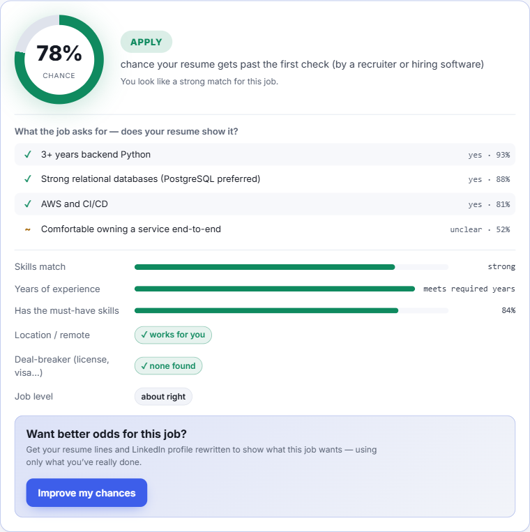

# ShouldIApply — free AI job fit checker and resume matcher

**Paste a job ad and see your real chance of getting past the resume screen — before you spend an hour applying.**
Then see exactly what you're missing, get your resume and LinkedIn wording improved for that job, and track every application. Free, private, no account.

[](https://notsointresting.github.io/shouldiapply/)
[](LICENSE)
[](#privacy)
[](https://github.com/notsointresting/shouldiapply/stargazers)

**👉 [Open ShouldIApply](https://notsointresting.github.io/shouldiapply/)**



## Who it's for

- **Job seekers** who send lots of applications and want to spend time on the ones they can actually get.
- **Career switchers** who want to know which requirements they already meet and which ones are real gaps.
- **Anyone tired of ATS keyword scores** that say "72% match" without saying whether you'll get a call.

## What it does

| Feature | What you get |
| --- | --- |
| **Resume screen chance** | Your estimated chance of getting past the first resume check (recruiter or ATS), with an Apply / Worth a try / Probably skip verdict and plain reasons. |
| **Requirement checklist** | Each must-have from the job ad marked ✓ yes, ~ unclear, or ✗ not on your resume. |
| **Improve my chances** | Rewritten resume bullets, LinkedIn headline and About section aimed at this job's gaps — **using only what you've really done**. Invented numbers are flagged; gaps wording can't fix get honest next steps. |
| **Job application tracker** | Save jobs you applied to, update status (applied → interview → offer), notes, search, filters, CSV export, backups. |
| **Were the predictions right?** | Compares the predicted chance with your real interview rate, so you can see if the estimates hold up for you. |
| **Resume upload** | Import your resume from PDF or text. |
| **Compare jobs** | Every job you check is ranked by your chance, side by side. |

## How it works

1. **Sign in with Pollinations** — you pay a tiny amount of your own AI credit (Pollen) per check; there's no subscription and no account with us.
2. **Add your resume** once — it's saved only in your browser.
3. **Paste a job ad** and click **Should I apply?**

Under the hood, one call to **Jev** — a decision model on [Pollinations](https://pollinations.ai) that returns calibrated probabilities instead of free text — answers typed questions in parallel: pass-the-screen probability, skills overlap, experience, seniority, location fit, deal-breakers (license, degree, clearance, work permit) and one yes/no per requirement. The verdict rules live in code, not in the model. "Improve my chances" uses a separate text model through the OpenAI-compatible `/v1/chat/completions` endpoint.

## Why not a keyword-match resume scanner?

Most resume checkers count overlapping keywords (TF-IDF) or ask a generic chatbot for a score. A keyword score tells you which words match; it doesn't tell you your odds. ShouldIApply asks a model built to be **honest about probability**, shows *which* requirements you're missing, and refuses to invent experience when it helps you rewrite.

## Privacy

- Your resume, job ads and application history stay in your browser (`localStorage`). There is no backend.
- Sign-in uses OAuth 2.1 + PKCE; the access token lives only for the browser tab (`sessionStorage`).
- Only the resume and job ad text are sent to Pollinations when you run a check.

## Run it yourself

It's a static site — plain HTML, CSS and JavaScript, no build step.

```bash
git clone https://github.com/notsointresting/shouldiapply.git
cd shouldiapply
python -m http.server 8000   # then open http://localhost:8000/
npm test                     # optional: logic checks
```

It uses a public Pollinations App Key (`pk_…`) in `config.js`. To use your own, create one at [enter.pollinations.ai/keys](https://enter.pollinations.ai/keys) and add your site URL (and `http://localhost:8000/`) as redirect URIs.

## Tech stack

- Vanilla JavaScript (ES modules), HTML, CSS — no framework, no build
- [Pollinations](https://pollinations.ai) — Jev decision model (`/alpha/decisions`) and text models (`/v1/chat/completions`), Bring Your Own Pollen sign-in
- [pdf.js](https://mozilla.github.io/pdf.js/) for resume PDF import (loaded only when used)
- Service worker for offline use; hosted on GitHub Pages

### Project files

| File | Purpose |
| --- | --- |
| `index.html` | The page: Check a job · My resume · My applications. |
| `styles.css` | Styling, light and dark theme. |
| `config.js` | App Key, endpoints, model names. |
| `auth.js` | Sign-in (OAuth 2.1 + PKCE). |
| `jev.js` | The check: one `/alpha/decisions` call, requirement extraction, verdict rules. |
| `improve.js` | "Improve my chances": rewrite prompt + invented-number guard. |
| `tracker.js` | Local application tracker, backups, CSV export. |
| `app.js` | Controller. |
| `sw.js`, `manifest.webmanifest`, `icon.svg` | Installable + offline. |
| `test.mjs` | `npm test`. |

## Honest limits

- The chance is an **estimate from your resume and the job ad** — a guide, not a guarantee. It can't see the other applicants.
- PDF import reads text only; scanned (image) PDFs need to be pasted.
- There's deliberately **no auto-apply**. Mass auto-applying hurts candidates and gets flagged. ShouldIApply helps you *decide*.

## Credits

Ideas adapted (MIT) from [hugounoclaw/ats-checker](https://github.com/hugounoclaw/ats-checker) (paste-and-score UX), [ParasKoundal/JobTracker](https://github.com/ParasKoundal/JobTracker) (local tracker), and the Profile Optimizer in [sergebulaev/linkedin-skills](https://github.com/sergebulaev/linkedin-skills) (rewrite rules). Built on [Pollinations](https://pollinations.ai) following their [Bring Your Own Pollen](https://github.com/pollinations/pollinations/blob/main/BRING_YOUR_OWN_POLLEN.md) guide. Curious about decision models? See [awesome-jev-family](https://github.com/notsointresting/awesome-jev-family).

## Support the project

⭐ If ShouldIApply saved you time, [star it on GitHub](https://github.com/notsointresting/shouldiapply) — it helps other job seekers find it. Bugs and ideas: [open an issue](https://github.com/notsointresting/shouldiapply/issues).

## License

[MIT](LICENSE)
